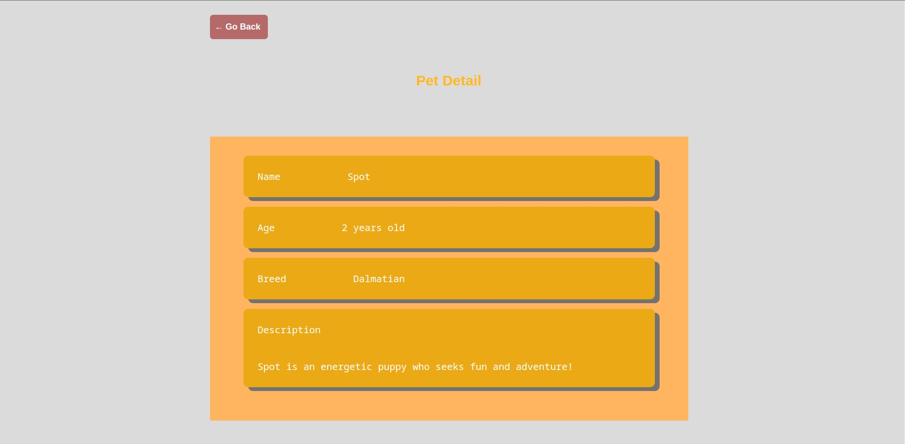

# Python Project (Simple App)

Made with Python Framework Flask.

### Project OverView page

<a href="https://github.com/inforgstr/FSPR4-22/tree/main/Semester_3/Lesson_25_simple_app/overview/webpage.png">

</a>

#### Structure

```
├── app
│   ├── app.py
│   ├── models.py
│   └── views.py
├── config.py
├── overview
│   └── webpage.png
├── readme.md
├── run.py
└── web
    ├── static
    │   └── css
    │       └── style.css
    └── templates
        ├── base.html
        ├── index.html
        ├── pet_detail.html
        └── pet_list.html
```

Note: You should rename `.env.shared` to `.env.secret`
and change ``DEBUG-MODE`` to `True or False`

### Run project with the command below

`python run.py`
