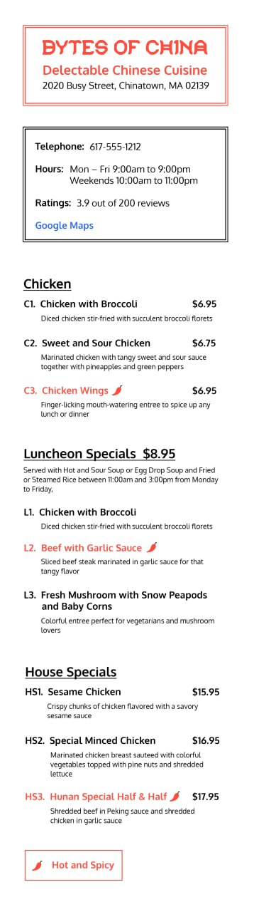

# Build A Menu For Bytes Of China
A new restaurant, Bytes of China, has just moved to a busy street in Chinatown from a previous location. Bytes of China has hired you to design its database schema so that it can display its menu on its new website, It has provided you with a copy of its current menu.



Bytes of China describes itself on its website as follows:
```
Bytes of China, delectable Chinese cuisine
2020 Busy Street, Chinatown, MA 02139
Telephone: 617-555-1212
Hours: Mon - Fri 9:00 am to 9:00 pm,  Weekends 10:00 am to 11:00 pm
Ratings: 3.9 out of 200 reviews
Google Map
```

A web page called Menu should have the following categories:

Appetizers, Soup, Chicken, Beef, Veal, Vegetarian, Rice and Noodles, Luncheon Specials, House Specials

Under each category should be a list of dishes in this sample format: 
```
Category  Name
Code1. Dish Name 1        Price 1
           Dish Description 1
Code2. Dish Name 2 *        Price 2
           Dish Description 2
           
```

Certain dishes have an asterisk, *, to mark it as hot and spicy.

Certain categories such as Luncheon Specials provide additional information to the customer but all the dishes have the same price.:
```
Luncheon Specials, $8.95
Served with Hot and Sour Soup or Egg Drop Soup and Fried or Steamed Rice  between 11:00 am and 3:00 pm from Monday to Friday.
```

In addition to a menu, a web page, Reviews, contains a collection of reviews from customers.
```
5.0  stars Awesome service. Would love to host another birthday party at Bytes of China! 05/22/2020
4.5  stars Other than a small mix-up, I would give it a 5.0!  04/01/2020
3.9  stars A reasonable place to eat for lunch, if you are in a rush!  03/15/2020
... 
```

As a database designer, you get to design a database schema and perform the following tasks:
- create tables
- define relationships between tables
- designate appropriate columns as keys
- insert sample data and
- make queries from the database
